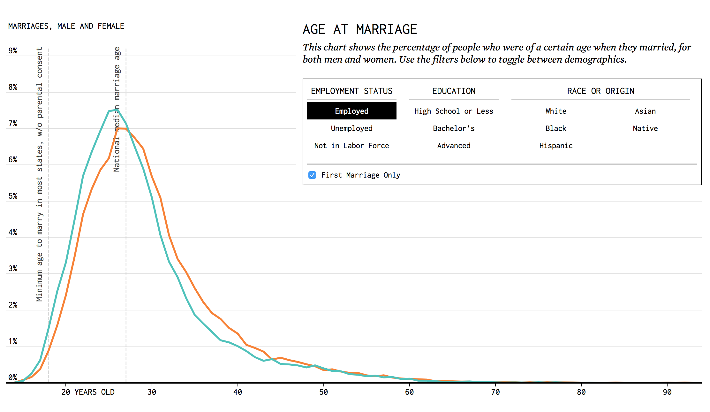
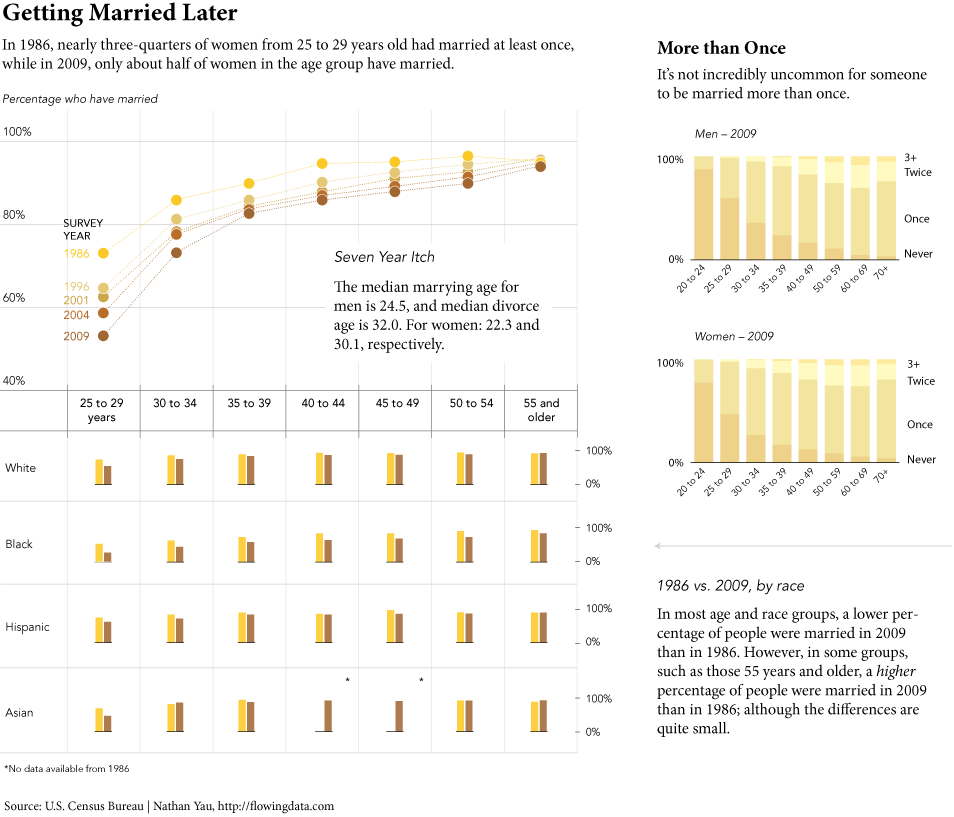
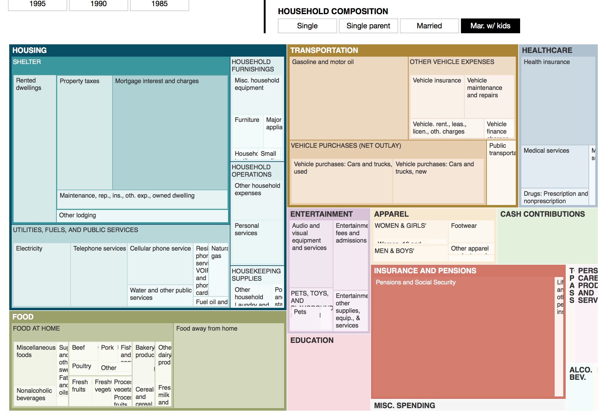

% Principles of Analytic Graphics
% Biostatistics 140.776
%

```{r, include=FALSE}
options(width = 50)
knitr::opts_chunk$set(comment = NA)
```

# Principles of Analytic Graphics

Principle 1: Show comparisons

* Evidence for an hypothesis is always **relative** to another competing hypothesis

* Always ask "Compared to What?"

# Show Comparisons


Reference: Butz AM, *et al.*, *JAMA Pediatrics*, 2011

# Show Comparisons


Reference: Butz AM, *et al.*, *JAMA Pediatrics*, 2011

# Principles of Analytic Graphics

Principle 1: Show comparisons

* Evidence for an hypothesis is always **relative** to another competing hypothesis

* Always ask "Compared to What?"

Principe 2: Show causality, mechanism, explanation, systematic structure

* What is your causal framework for thinking about a question?

# Show Causality, Mechanism


Reference: Butz AM, *et al.*, *JAMA Pediatrics*, 2011

# Show Causality, Mechanism


Reference: Butz AM, *et al.*, *JAMA Pediatrics*, 2011


# Principles of Analytic Graphics

Principle 1: Show comparisons

* Evidence for an hypothesis is always **relative** to another competing hypothesis

* Always ask "Compared to What?"

Principe 2: Show causality, mechanism, explanation, systematic structure

* What is your causal framework for thinking about a question?


Principle 3: Show multivariate data

* Multivariate = more than 2 variables
* The real world is multivariate
* Need to "escape flatland"


# Show Multivariate Data


# Show Multivariate Data


# Principles of Analytic Graphics

Principle 4: Integrate Evidence

* Completely integrate words, numbers, images, diagrams
* Data graphics should make use of many modes of data presentation
* Don't let the tool drive the analysis


# Integrate Evidence


# Integrate Evidence



Source: http://flowingdata.com/2016/03/03/marrying-age/

# Integrate Evidence



Source: http://flowingdata.com/2011/05/23/when-do-people-get-married-and-divorced/

# Integrate Evidence



Source: http://flowingdata.com/2015/04/02/how-we-spend-our-money-a-breakdown/

# Principles of Analytic Graphics

Principle 4: Integrate Evidence

* Completely integrate words, numbers, images, diagrams
* Data graphics should make use of many modes of data presentation
* Don't let the tool drive the analysis


Principle 5: Describe and document the evidence with appropriate labels, scales, sources, etc.

* A data graphic should tell a complete story that is credible
* Same is true for a slide in a presentation

# Document the Evidence


# Principles of Analytic Graphics

Principle 4: Integrate Evidence

* Completely integrate words, numbers, images, diagrams
* Data graphics should make use of many modes of data presentation
* Don't let the tool drive the analysis


Principle 5: Describe and document the evidence with appropriate labels, scales, sources, etc.

* A data graphic should tell a complete story that is credible
* Same is true for a slide in a presentation

Principle 6: Content is king

* Analytical presentations ultimately stand or fall depending on the *quality*, *relevance*, and *integrity* of their content


# Summary


Principle 1: Show comparisons

Principle 2: Show causality, mechanism, explanation

Principle 3: Show multivariate data

Principle 4: Integrate multiple modes of evidence

Principle 5: Describe and document the evidence

Principle 6: Content is king


# Reference

Edward Tufte (2006). Beautiful Evidence, Graphics Press LLC. www.edwardtufte.com
